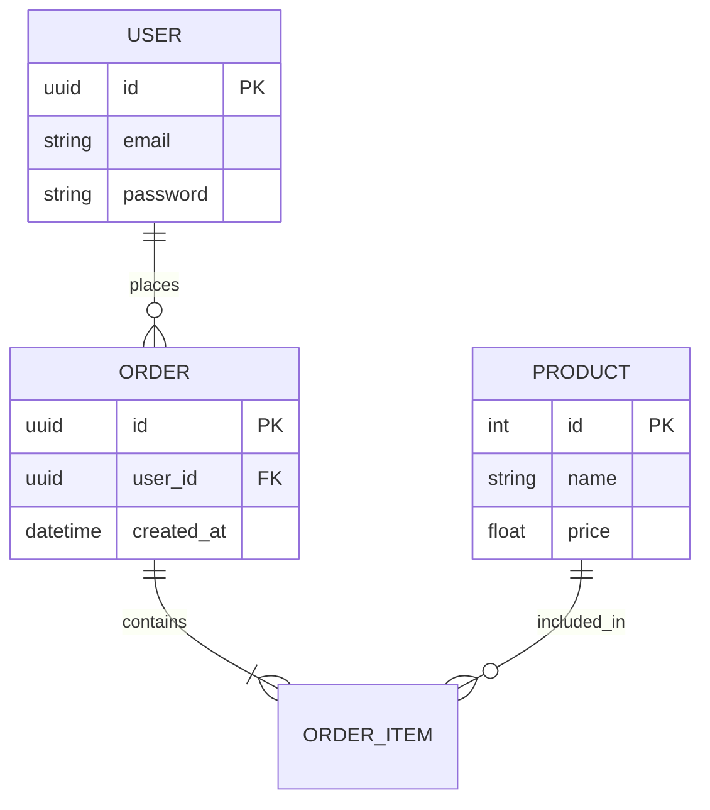

# Diagramas ER (Entidad-Relación): Visualizando la Data

Antes de escribir una sola línea de SQL, un ingeniero profesional diseña el diagrama de la base de datos. Esto permite detectar errores de lógica y redundancia de forma visual y temprana.

## 1. Componentes Clave

*   **Entidades (Rectángulos):** Los "objetos" de tu sistema (Usuario, Pedido, Producto).
*   **Atributos (Óvalos o Lista):** Las propiedades de esa entidad (email, fecha, precio).
*   **Relaciones (Rombos o Líneas):** Cómo se conectan las entidades entre sí.

## 2. Tipos de Relaciones (Cardinalidad)

### Uno a Uno (1:1)
*   **Ejemplo:** Un `Usuario` tiene un `Perfil`.
*   **Implementación:** El `perfil_id` está en `Users` o el `user_id` está en `Profiles` (con clave UNIQUE).
*   *Backend Tip:* A veces es mejor tener todo en una sola tabla si la relación es 1:1 estricta, a menos que el perfil tenga muchos datos opcionales.

### Uno a Muchos (1:N)
*   **Ejemplo:** Un `Cliente` realiza muchos `Pedidos`.
*   **Implementación:** La FK (`cliente_id`) siempre va en el lado de los "Muchos" (`Pedidos`).

### Muchos a Muchos (N:M)
*   **Ejemplo:** Un `Estudiante` se inscribe en muchos `Cursos` y un `Curso` tiene muchos `Estudiantes`.
*   **Implementación:** Requiere una **Tabla Intermedia** (o Tabla de Unión) que contenga las FKs de ambos lados.
    *   *Tabla Inscriptions:* `estudiante_id`, `curso_id`, `fecha_inscripcion`.

## 3. Notación "Pata de Gallo" (Crow's Foot)

Es la notación más usada en la industria.
*   Una línea recta: "Uno y solo uno".
*   Un círculo y pata de gallo: "Cero o muchos".
*   Una línea y pata de gallo: "Uno o muchos".

## 4. De Diagrama a SQL

| Elemento ER | Implementación SQL |
| :--- | :--- |
| Entidad Fuerte | `CREATE TABLE` con PK propia |
| Entidad Débil | `CREATE TABLE` con FK que forma parte de la PK |
| Relación N:M | Tabla Asociativa nueva |
| Atributo Multivaluado | Tabla nueva 1:N o columna `ARRAY/JSONB` |

## 5. Herramientas Recomendadas para Backend Developers

1.  **dbdiagram.io:** Estupenda para generar diagramas escribiendo código (DBML).
2.  **draw.io:** Propósito general, gratis y flexible.
3.  **DBeaver / pgAdmin:** Generan el diagrama ER automáticamente a partir de una base de datos ya existente.
4.  **Mermaid.js:** Ideal para documentar diagramas directamente en tus archivos Markdown de Git.

## Resumen: Diseña Antes de Programar

Un diagrama ER no es solo un dibujo; es el contrato oficial de tu aplicación. Si el diagrama está mal, el código Python que escribas encima estará condenado al fracaso o a refactorizaciones dolorosas.
