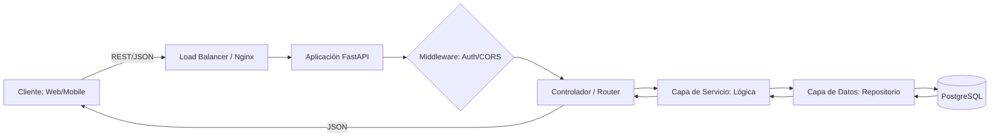

# Arquitectura de una API REST Profesional

Entender el flujo de información es vital para depurar problemas complejos. Así es como "viaja" un dato en una arquitectura moderna basada en FastAPI.

## 1. El Flujo de una Petición (Request Lifecycle)

## 2. Stateless: El Corazón de REST
La regla más importante de una API REST es que es **Sin Estado (Stateless)**.
*   El servidor no "recuerda" al cliente entre peticiones.
*   Cada petición debe llevar toda la información necesaria (ej: el Token JWT en el Header).
*   **Ventaja:** Esto hace que escalar sea trivial. Si tienes 10 servidores, da igual a cuál llegue la petición, todos sabrán qué hacer.

## 3. Separación de Responsabilidades (SOC)

En este tema implementaremos una estructura de 4 capas:
1.  **Schemas (Pydantic):** Definen la forma del dato que entra y sale.
2.  **Routes:** Gestionan los Endpoints y el protocolo HTTP.
3.  **Services:** Donde vive la "magia" y las reglas de negocio.
4.  **Models (SQLAlchemy):** La representación de la base de datos.

## 4. Inyección de Dependencias
Usaremos el patrón de Inyección de Dependencias para pasar la sesión de la base de datos a nuestras rutas. Esto permite:
*   Cambiar la DB fácilmente en tests.
*   Asegurar que la sesión se cierre siempre al terminar el request.

## 5. El Contrato: OpenAPI
FastAPI genera automáticamente un archivo `openapi.json`. Este es el "manual de instrucciones" de tu backend. Cualquier cliente que lo lea sabe exactamente qué enviar y qué esperar recibir, sin necesidad de que tú le expliques nada.

## Resumen: Orden es Escalabilidad

Una API no es solo un montón de funciones sueltas. Es una estructura jerárquica diseñada para que el código sea predecible. Si mantienes esta estructura, tu aplicación podrá crecer de 10 a 1000 endpoints sin convertirse en código espagueti.
