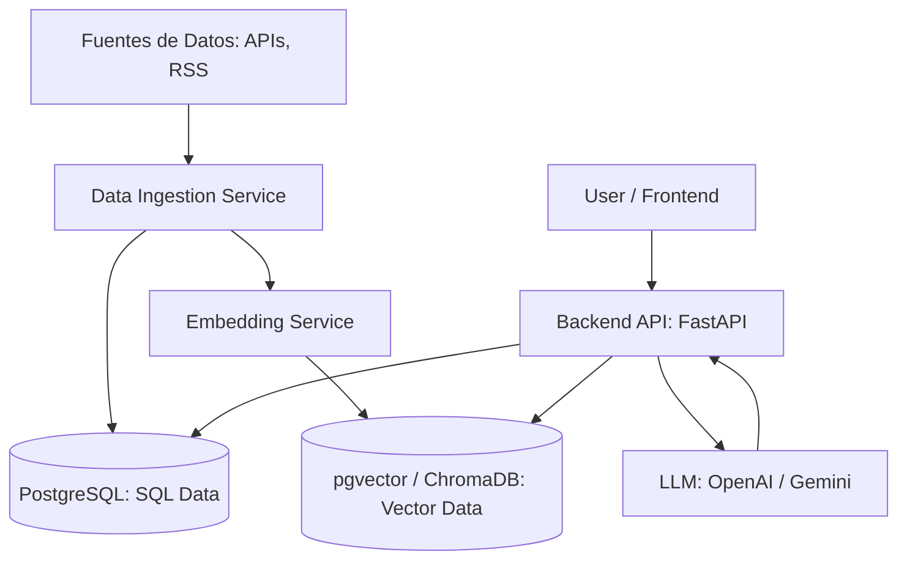

# Arquitectura del Sistema: "Market Intelligence Engine"

Un sistema profesional no es solo código; es una orquestación de servicios que trabajan juntos. Esta es la arquitectura que vamos a implementar.

## 1. El Diagrama de Flujo

## 2. Componentes Clave

### A. Capa de Datos (Storage)
*   **PostgreSQL:** Para datos relacionales (Metadatos de noticias, perfiles de usuario, roles).
*   **Vector DB:** Para la búsqueda semántica acelerada de los trozos de noticias.

### B. Capa de Lógica (Compute)
*   **Backend (FastAPI):** El orquestador. Maneja la autenticación, la lógica de negocio y la comunicación con la IA.
*   **Worker:** Un proceso en segundo plano (puedes usar un simple script en Docker) que realiza la ingesta periódica de datos.

### C. Capa de Inteligencia (AI)
*   **Embeddings:** Modelo para convertir texto en vectores.
*   **Generator (LLM):** El cerebro que redacta las respuestas basándose en el contexto recuperado (RAG).

## 3. Despliegue con Docker
Todo el sistema debe vivir en una red de Docker para que sea reproducible:
*   `ui`: Frontend (opcional para el portfolio). 
*   `api`: El backend de Python.
*   `db`: PostgreSQL.
*   `redis`: (Opcional) para caché y colas de tareas.

---

## Reto de Ingeniería
Tu misión es asegurar que la comunicación entre estos servicios sea segura (usando redes internas de Docker) y que el sistema sea capaz de escalar si el volumen de noticias aumenta de 100 a 100.000.
